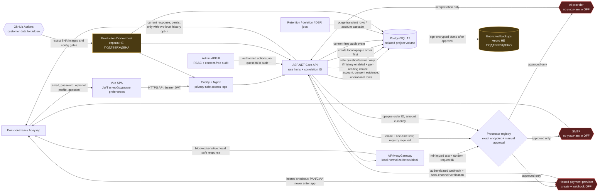
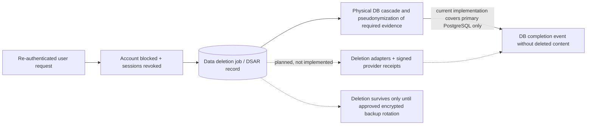

# Потоки данных alex-taro.ru

Актуально после технической remediation на 1 августа 2026 года. Красным отмечены внешние контуры, которые остаются выключенными до документального подтверждения; жёлтым — фактическое размещение, которое нельзя установить по репозиторию.



## Регистрация и фиксация согласий

```mermaid
sequenceDiagram
    participant U as Пользователь
    participant B as Vue SPA
    participant A as API
    participant D as PostgreSQL
    U->>B: Открывает регистрацию
    B-->>U: Email, пароль, один выключенный checkbox согласия на ПД
    Note over B,U: Отдельный checkbox ПД; оферта, политика и 18+ явно описаны у кнопки «Создать»
    Note over B,U: Персонализация, маркетинг и аналитика выключены и не предлагаются при регистрации
    U->>B: Отмечает согласие на ПД и нажимает «Создать»
    B->>A: Флаги + точные версии offer/privacy/personal-data-consent
    alt нет любого обязательного действия или версия не активна
        A-->>B: Отказ в регистрации; consent evidence не создаётся
    else все обязательные действия подтверждены
        A->>D: Account + отдельные versioned consent records
        A-->>B: Registration accepted only if legal publication gate is approved
    end
```

`PersonalDataProcessingConsent` — отдельная обязательная запись, связанная с документом `/legal/personal-data-consent`; она не выводится из принятия оферты, ознакомления с политикой или 18+. Ознакомление с политикой не называется согласием. Изменение версии документа не создаёт новое согласие автоматически. Фактический текст, правовые основания и последствия отзыва обязательного согласия ещё должны быть утверждены оператором и юристом; legal publication и release остаются заблокированными.

## Создание расклада после remediation

```mermaid
sequenceDiagram
    participant B as Browser
    participant A as API
    participant G as AiPrivacyGateway
    participant D as PostgreSQL
    participant R as Processor registry
    participant X as Approved AI
    B->>A: question + saveToHistory=false by default
    A->>G: raw input in-process
    alt PII / third party / special category / high-stakes request
        G-->>B: local block or safe emergency response
    else eligible minimized question
        A->>D: operational row; question/answer empty when history is off
        A->>R: provider + exact HTTPS endpoint
        alt provider is not fully verified
            R-->>B: feature unavailable; no disclosure
        else manually approved provider
            A->>X: minimal prompt + cards + random request ID; no email/FIO/DOB/Telegram/IP/user UUID
            X-->>A: interpretation
            opt account history enabled AND per-reading choice checked
                A->>D: persist minimized question and interpretation
            end
            A-->>B: transient result with AI/Tarot disclaimer
        end
    end
```

AI memory extraction and external feedback scoring are disabled. Application logs and audit events record only operation type, status, correlation/request ID and error type; the question and AI output are not logged.

## Платёж после remediation

```mermaid
sequenceDiagram
    participant U as User
    participant A as API
    participant D as PostgreSQL
    participant P as Approved hosted provider
    A->>D: INSERT opaque local order + tariff/amount/currency/duration + idempotency key
    A->>P: create hosted payment with opaque public order ID
    P-->>U: hosted checkout URL
    U->>P: card data (outside alex-taro.ru)
    P->>A: webhook
    A->>A: provider authenticity/source check
    A->>P: authenticated status lookup
    A->>D: compare order/provider/amount/currency/tariff; durable replay check
    A->>D: activate once; receipt_status=pending_manual_issue
```

Payments and the webhook remain disabled until the payment processor, receipt procedure and consumer terms are approved. YooMoney uses HMAC verification; YooKassa uses the documented source-address allowlist plus authenticated status lookup.

## Удаление и резервные копии



Фактический processor сейчас удаляет данные только из основной PostgreSQL. Redis/search/object storage/analytics в текущем коде не настроены, но adapters и подписанные подтверждения удаления для будущих/внешних систем не реализованы. Удаление из резервных копий нельзя подтвердить до выбора storage, утверждения срока ротации и restore drill. Поэтому release остаётся заблокирован.

## Изоляция alex-taro.ru / janetka.ru

```mermaid
flowchart TB
    NET[Shared public IP]
    EDGE[Shared edge\nexact host/SNI routes]
    FV[future-viewer project\n/opt/fv-app]
    FVENV[/opt/fv-app/.env.production]
    FVDB[(future_viewer DB\nunique user/volume/key)]
    FVLOG[(future-viewer logs/backups)]
    JAN[janetka project\nseparate directory/project]
    JANENV[separate env/secrets]
    JANDB[(separate DB/user/volume)]
    JANLOG[(separate logs/backups)]
    NET --> EDGE
    EDGE -->|Host: alex-taro.ru only| FV
    EDGE -->|Host: janetka.ru only| JAN
    FV --> FVENV
    FV --> FVDB
    FV --> FVLOG
    JAN --> JANENV
    JAN --> JANDB
    JAN --> JANLOG
```

Репозиторий теперь содержит project-scoped Compose, loopback upstream, пример exact shared-edge route и isolation check. Это не доказывает состояние живого host: инвентаризация обоих проектов, ACL, БД, secrets, logs и backups остаётся ручным P0.
